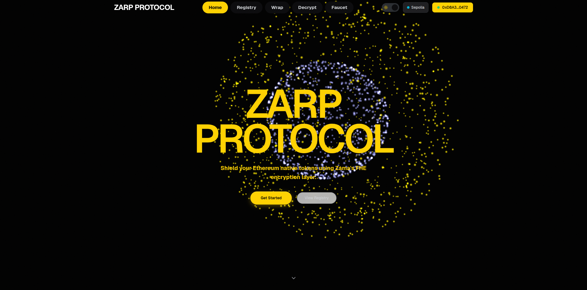
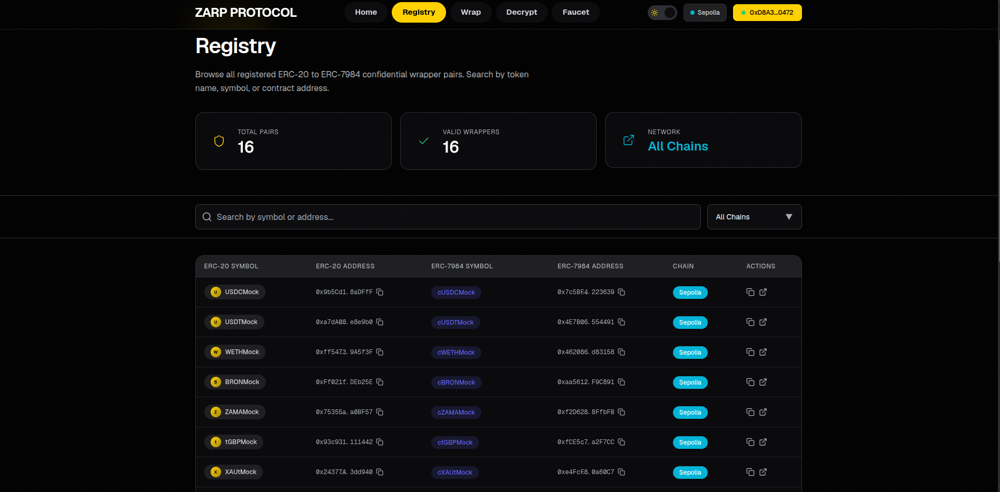
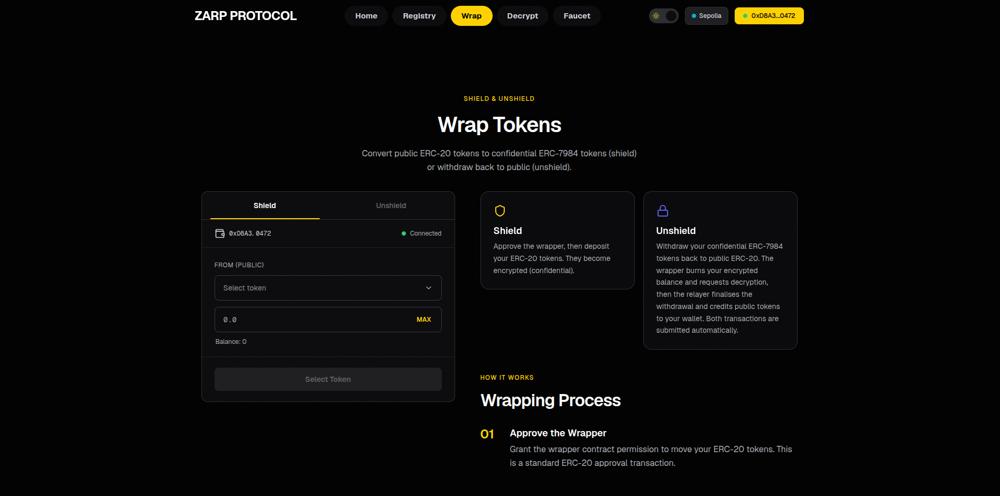
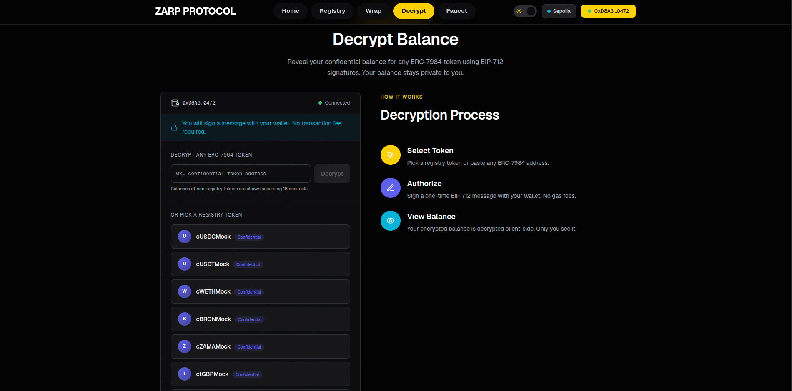
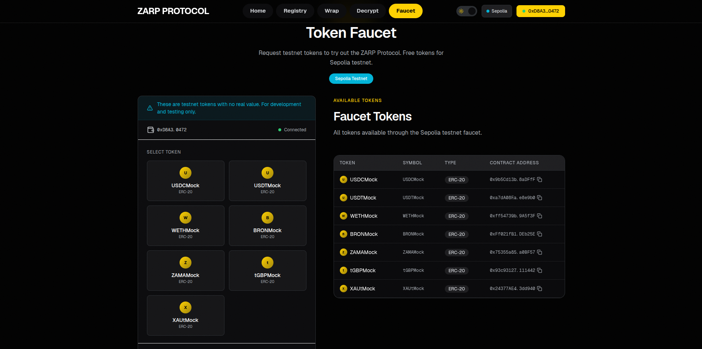

# ZARP Protocol — Confidential Wrapper Registry dApp

A production-oriented dApp for the **Zama Wrappers Registry**. Connect a wallet and:

- **Browse the registry** — every official ERC-20 ↔ ERC-7984 confidential wrapper pair on **Sepolia** and **Ethereum mainnet**, read from the on-chain Wrappers Registry (with a local-config fallback/extension layer).
- **Wrap / unwrap** — convert any registry ERC-20 into its confidential ERC-7984 equivalent and back, on either network.
- **Decrypt balances** — reveal the decrypted balance of **any ERC-7984 token** in your wallet (registry token *or* a pasted address) via the EIP-712 user-decryption flow.
- **Use the faucet (Sepolia)** — claim the official `cTokenMock` test tokens to try wrap/unwrap immediately.

Built with **Next.js 14 (App Router)**, **wagmi v2 + RainbowKit**, and the **`@zama-fhe/sdk@^3` / `@zama-fhe/react-sdk@^3`** Token API.

---

## Live Demo & Video

🔗 **Live app:** [https://zarp-protocol.vercel.app](https://zarp-protocol.vercel.app)  
🎥 **Video walkthrough (~3 min):** [Watch on Loom](YOUR_VIDEO_URL_HERE)

---

## Screenshots & UI Gallery

### Homepage & Features


### Core DApp Interfaces

| Registry Browser | Wrap / Unwrap | Decrypt Balance |
|:---:|:---:|:---:|
|  |  |  |

### Testnet Token Faucet


---

## Architecture

```
Browser (Next.js, "use client")
 ├─ wagmi + RainbowKit        → wallet, chain switching (mainnet + sepolia)
 ├─ @zama-fhe/react-sdk       → ZamaProvider, useListPairs, useShield/useUnshield,
 │                              useAllow/useUserDecrypt, ReadonlyToken.balanceOf()
 │     • encryption           → client-side WASM (SharedArrayBuffer; COOP/COEP set)
 │     • decryption           → EIP-712 → Zama relayer → KMS (threshold decrypt)
 └─ /api/relayer/[...path]    → server-side proxy; injects mainnet relayer API key
                                so it never reaches the browser
On-chain
 └─ WrappersRegistry          → PRIMARY source of truth for pairs (per chain)
Local config
 └─ lib/registry-data.ts      → static fallback + CUSTOM_PAIRS extension point
```

**Source-of-truth model (hybrid, per the spec):** the on-chain registry is read first via `useListPairs`; statically-declared pairs in `lib/registry-data.ts` are merged in as a fallback and as the extension point for custom/dev pairs. See `hooks/useChainPairs.ts`.

**Confidentiality:** all decryption happens client-side after the user's own EIP-712 signature. No plaintext balance is logged, emitted, or sent to any server. On Sepolia the relayer is keyless; on mainnet the API key stays server-side behind the proxy route.

---

## Prerequisites

- **Node.js 22+** (the `@zama-fhe/sdk` declares `engines.node >= 22`).
- A browser wallet (**MetaMask** or any WalletConnect wallet).
- **Sepolia test ETH** for gas (wrap/unwrap/faucet are real transactions). Grab some from a public faucet such as `https://sepoliafaucet.com` or `https://www.alchemy.com/faucets/ethereum-sepolia`. *(This is ETH for gas — different from the in-app token faucet, which mints the cTokenMock ERC-20s.)*

## Getting started

```bash
cd frontend
npm install            # postinstall patches a wagmi v2/v3 mismatch in the SDK
cp .env.example .env.local   # then fill in values (all optional for Sepolia)
npm run dev            # http://localhost:3000
```

> **First run on Sepolia needs zero configuration** — public defaults cover RPC
> and the (keyless) Sepolia relayer. Connect a wallet on Sepolia, claim tokens
> from the Faucet page, then try Wrap → Decrypt.

Build for production:

```bash
npm run build && npm start
```

> **Node 22+** is required (the new Zama SDK declares `engines.node >= 22`).

### Environment variables

All are optional for the **Sepolia** demo (sensible public defaults are used). Mainnet decryption requires `RELAYER_API_KEY`.

| Variable | Scope | Purpose |
|---|---|---|
| `NEXT_PUBLIC_WALLETCONNECT_PROJECT_ID` | client | WalletConnect project id (RainbowKit). |
| `NEXT_PUBLIC_SEPOLIA_RPC` | client | Sepolia RPC (defaults to a public node). Use a keyed provider for production. |
| `NEXT_PUBLIC_MAINNET_RPC` | client | Mainnet RPC (defaults to a public node). |
| `NEXT_PUBLIC_RELAYER_PROXY_URL` | client | Base path of the relayer proxy (e.g. `/api/relayer`). Enables mainnet decrypt. |
| `NEXT_PUBLIC_ZAMA_RELAYER_URL` | client | Optional Sepolia relayer override. |
| `RELAYER_API_KEY` | **server only** | Mainnet relayer API key, injected by `/api/relayer/[...path]`. **Never** prefix with `NEXT_PUBLIC_`. |

Each chain uses a `fallback` RPC transport (configured RPC → public backups) so one throttled endpoint doesn't take the app down.

---

## Networks

| Feature | Sepolia | Mainnet |
|---|---|---|
| Browse registry | ✅ | ✅ |
| Wrap / unwrap | ✅ | ✅ |
| Decrypt (registry + any address) | ✅ | ✅ (requires relayer proxy + `RELAYER_API_KEY`) |
| Faucet | ✅ | — (Sepolia-only; UI prompts to switch) |

Registry contract addresses (`lib/registry-data.ts`):
- Sepolia: `0x2f0750Bbb0A246059d80e94c454586a7F27a128e`
- Mainnet: `0xeb5015fF021DB115aCe010f23F55C2591059bBA0`

---

## How this satisfies the bounty

This submission directly addresses all requirements of the **Zama Developer Program Bounty Track — Confidential Wrapper Registry App**:
- **Confidential Wrappers Registry integration**: Surfaces all official ERC-20 ↔ ERC-7984 pairs registered on-chain via the `WrappersRegistry` contract on both Sepolia and Ethereum Mainnet. Includes a static configuration fallback.
- **Shield and Unshield Operations**: Users can deposit underlying tokens to mint confidential wrappers, and burn/finalize them to withdraw.
- **EIP-712 User Decryption**: Leverages `@zama-fhe/sdk`'s session keypair signature flow to securely request threshold decryption of private balances from the Zama Relayer KMS.
- **IP-Based Relayer Proxy**: Keeps the mainnet relayer key server-side inside Next.js API routing to prevent leakage, hardened with origin/referer verification and IP rate-limiting.
- **Full Testnet Faucet Support**: Integrates an easy-to-use minting interface for the official cTokenMock underlying tokens on Sepolia.

---

## Adding a new ERC-20 ↔ ERC-7984 pair

There are two ways a pair shows up in the app.

### 1. Automatically (on-chain registry)

If the pair is registered in the on-chain Wrappers Registry, it appears with **no code change** — `useListPairs` reads it live for the connected chain. This is the recommended path for official pairs.

### 2. Locally (custom / dev-only pairs)

To surface a pair the registry does not (yet) list — e.g. a token you deployed for testing — add it to `CUSTOM_PAIRS` in **`frontend/lib/registry-data.ts`**:

```ts
// frontend/lib/registry-data.ts
export const CUSTOM_PAIRS: WrapperPairConfig[] = [
  {
    erc20:   { address: "0xYourErc20Address",   symbol: "FOO",  decimals: 18 },
    erc7984: { address: "0xYourWrapperAddress", symbol: "cFOO", decimals: 18 },
    chainId: 11155111, // 11155111 = Sepolia, 1 = mainnet
  },
];
```

That's it. The pair is merged into the registry browse, the wrap/unwrap token list, and the decrypt picker for the matching chain (on-chain entries take precedence on address collisions). No rebuild of any other file is needed. To register a pair **on-chain** instead, submit it to the WrappersRegistry contract per the Zama Protocol docs; it will then appear via path (1).

---

## Project structure

```
frontend/
├─ app/
│  ├─ api/relayer/[...path]/route.ts   # server-side relayer proxy (mainnet key)
│  ├─ registry/  wrap/  decrypt/  faucet/   # feature routes
│  └─ layout.tsx, page.tsx
├─ hooks/
│  ├─ useChainPairs.ts   # chain-aware pair source (on-chain first + fallback)
│  ├─ useRegistry.ts     # registry browse (search/filter)
│  ├─ useWrap.ts         # shield/unshield via @zama-fhe/react-sdk
│  ├─ useDecrypt.ts      # EIP-712 user-decryption lifecycle
│  └─ useFaucet.ts       # Sepolia cTokenMock faucet
├─ lib/
│  ├─ registry-data.ts   # chains, registry addresses, pairs, CUSTOM_PAIRS
│  ├─ fhevm.ts           # relayer URL resolution, TTLs
│  └─ faucet.ts          # faucet ABI/helpers
├─ providers/FhevmProvider.tsx          # wagmi → QueryClient → ZamaProvider
└─ next.config.mjs                       # COOP/COEP headers for FHE WASM
```

---

## Troubleshooting

| Symptom | Cause / fix |
|---|---|
| Encryption fails / WASM won't init | The page needs COOP `same-origin` + COEP `credentialless`. These are set in `next.config.mjs`; confirm your host doesn't strip them (Vercel preserves `headers()`). |
| `npm install` errors on `@zama-fhe/relayer-sdk` version | The `overrides` in `package.json` pin `0.4.1`; run `rm -rf node_modules package-lock.json && npm install`. |
| Mainnet decrypt returns 503 | `RELAYER_API_KEY` isn't set on the server. Set it (and `NEXT_PUBLIC_RELAYER_PROXY_URL=/api/relayer`). Sepolia is unaffected. |
| "No confidential balance" on decrypt | Expected when the token was never shielded — shield first, then decrypt. |
| Faucet button disabled | You're not on Sepolia (faucet is Sepolia-only) or within the 24h per-token cooldown. |
| Wrong balance shown | Make sure the token's `decimals` are correct in `lib/registry-data.ts` (registry tokens carry their own decimals; pasted tokens assume 18). |

> The Sepolia cTokenMocks expose a **permissionless `mint(address,uint256)`**
> (verified on-chain), so any wallet can self-mint test tokens via the Faucet.

## Security notes

- **COOP/COEP** headers (`same-origin` + `credentialless`) are set in `next.config.mjs` — required for the FHE WASM `SharedArrayBuffer`, and `credentialless` keeps WalletConnect working.
- **No relayer key in the browser.** Sepolia's relayer is open; mainnet's key is injected only by the server route.
- **Client-side decryption.** Balances are decrypted in the browser after the user's EIP-712 signature; nothing is sent to the app backend.

## License

MIT License. See [LICENSE](./LICENSE) for details.
